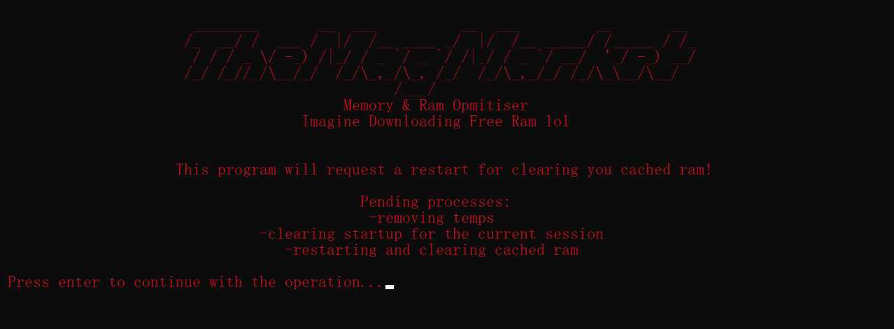

# FPSbooster
This is a script released from the Mag Market for free that clears up the cached ram and removes all the temps so your pc runs better :).  It works better on lower end devices and only for the current restart. Once its ran it will request admin and restart your device. Meanwhile it will clear up your startup for the session and remove all the temps aka dead storage. RESELLING THIS IS POINTLESS!!


<p align="center">
  
</p>

## Usage
ONLY COMPATIBLE WITH WINDOWS!
To install all the libs run:
```
pip install -r requirements.txt
```

# Constributors
✨Me✨
# Idea
discord: b_._o_._b
# External links
* https://t.me/TheMagMarket
* https://discord.gg/P8sKTTndqk
